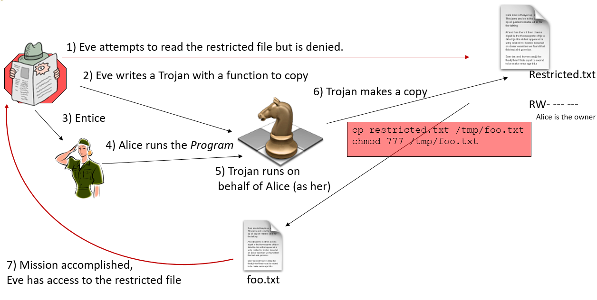

> IAM (Identity and Access Management) is a framework for managing user identities and controlling access to IT resources, while SSO (Single Sign-On) is its feature

В русскоязычной литературе для SSO встречается определение **федерация удостоверений**.

В качестве основного фреймворка для IAM используется [NIST 800-63-3](https://pages.nist.gov/800-63-3/), состоящий из 3 частей:
- Enrollment & Identity Proofing - предлагает трехуровневую модель Identity Assurance Level
- Authentication & Lifecycle Management
- Federation & Assertions

В этих же документах подчеркивается, что основным параметром пароля, обеспечивающим его криптостойкость, является его длина, и рекомендуется **не мучать пользователя сложными парольными политиками**.

## Аутентификация

>**Идентификация** - присвоение субъектам и объектам доступа личного идентификатора и сравнение его с заданным перечнем

>**Аутентификация** - проверка принадлежности субъекту доступа предъявленного им **идентификатора**

Классификация аутентификации по методу:
- На основании знания чего-либо (пароль, пин)
- На основании обладания чем-либо (физический токен)
- Свойство объекта (биометрия)

По уровню безопасности:
- Простая
- Строгая на основании криптографических методов
- Протоколы аутентификации обладающие свойством доказательства с нулевым знанием - **zero-knowledge proof** (also known as a **ZK proof** or **ZKP**)

По количеству шагов:
- Многофакторная (MFA, 2FA)
- Многошаговая (Two-step, 2SV) - дополнительный шаг, чаще всего включающий одноразовый код, полученный через сторонний канал (SMS, email)
- Paswordless

IP и геопозиция, параметры устройства, время входа - не являются самостоятельными факторами, а **параметрами аутентификации**, которые позволяют делать заключение о риске компрометации. Эти параметры позволяют реализовать **аутентификацию с учетом рисков** (risk-based).

TODO: implicit vs explicit authentication

TODO: unilateral authentication

## Авторизация

Модели контроля доступа можно разделить по возможности субъекта влиять на права доступа.

Систему можно назвать построенной на Discretionary Access Control (DAC), если создатель или владелец объекта может полностью управлять доступом к объекту, включая и список тех, кому разрешено изменять права доступа к объекту. Систему можно назвать обладающей Mandatory Access Control (MAC), если заданные пользователем права перекрываются системными ограничениями.

Наиболее известной уязвимостью DAC является проблема троянского коня:

По имплементации модели делятся на Access Control Lists (ACL) и Role Based Control Lists (RBAC).

Как правило ACL используются в ФС, например, в ext системах это права rwx для трех классов субъектов, в NTFS это более гранулярный контроль доступа с правами Modify, List Folder Contenrs, Traverse Folder и др.

Относительно новая модель - Attribute-Based Access Control (ABAC), рассматривающая атрибуты субъекта и объекта доступа, а также среды, например, время. Такая модель реализуется через политики доступа - XACML, ALFA, AWS policy, Rego. Rego, в частности, используется в Open Policy Agent (OPA) в k8s.

## Федерация

>**Identity broker** - сервис, позволяющий интегрировать различных Identity providers (IDP), например, OIDC, LDAP и SAML. Такой сервис реализует концепцию **federation identity management**. 

>SCIM - это открытый протокол, реализующий федеративный **user provisioning** - создание, обновление и удаление учетных записей

TODO: solicited authentication

## Делегация

>**Identity propagation** - это проблема авторизации сервиса-посредника (агента) с доступами пользователя.

Эту проблему можно решить тремя способами:
- Авторизация агента - избыток прав агента приводит к атакам **confused deputy**
- Авторизация пользователя - **имперсонация**; В системах AD это право дает атрибут `ms-DS-Allowed-To-Act-On-Behalf-Of-Other-Identity`.
- Использование комбинированного токена пользователь + агент - **делегация**; Наиболее известный протокол делегации - OAuth2.0
 

