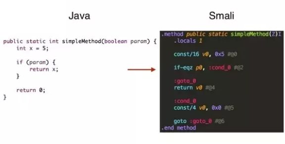
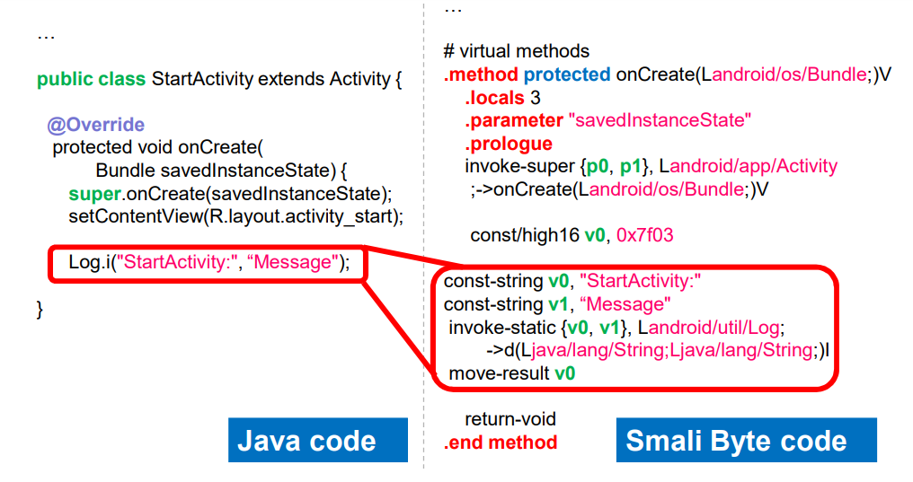
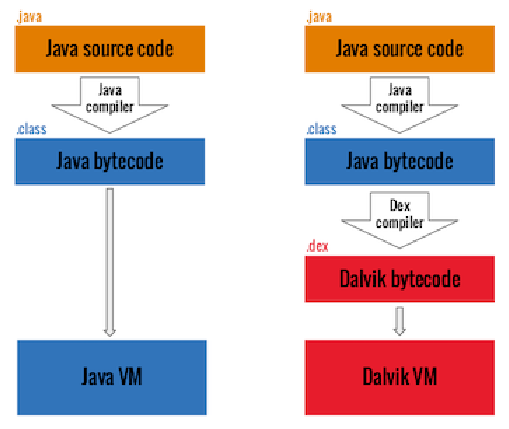
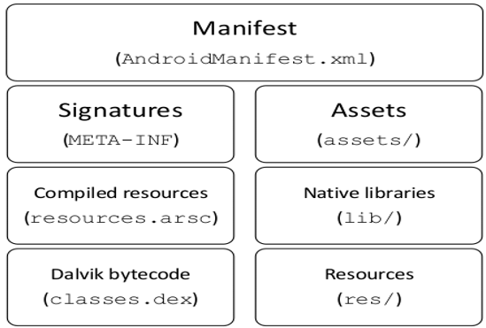
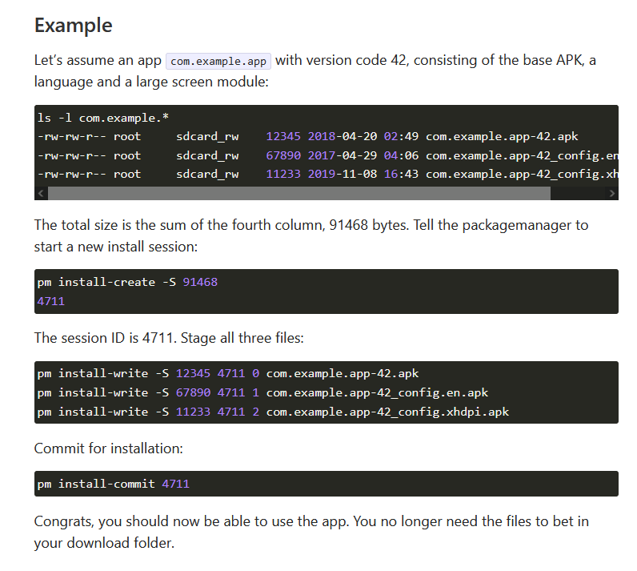
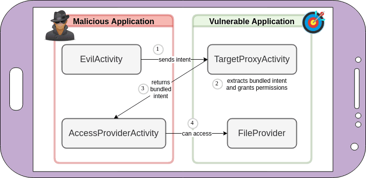
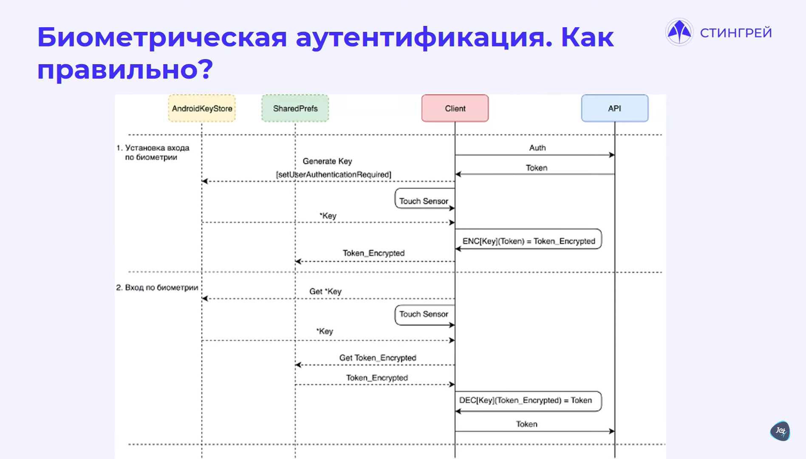

# Операционная система Android


Приложения для Android компилируются в байткод Dalvik (smali) - оптимизированный Java-байткод для аналога JVM - Android Runtime (ART). После запуска приложения JIT-компилятором наиболее используемые части прекомпилируются AOT в нативный код. Для вызова системных сервисов приложение использует Android Framework, в котором обращения к сервисам являются Java-методами, которые затем транслируются в IPC-вызовы.




Компилятор glibc для Android называется bionic. Приложение может использовать код на C/C++ для обращения к интерфейсам Java Native Interface, тогда приложение может обойти некоторые системные вызовы. Для защиты от этого в Android 8 (API level 26) используются фильтры Secure Computing (SECCOMP) для Zygote-процессов (программ в userspace).

Для декомпиляции и пересборки приложений используется apktool. У него есть графический интерфейс - [APK Easy Tool]()

Для конвертации одного представления кода в другое можно использовать набор утилит [Dex2jar](https://sourceforge.net/projects/dex2jar/), например, транслировать ARK в JAR или DEX в smali.



Приложения делятся на три типа:
- `Гибридные` - написаны на фреймворках (см. React Native) для создания приложений на Android и iOS одновременно
- `Нативные` - написаны на нативном языке (Java, Kotlin, Objective-C, Swift)
- `WebView` - HTML5-сайты, открывающиеся во встроенном браузере

Каждое приложение запускается в виртуальной машине Dalvik (sandbox), что позволяет ОС контролировать потребляемые им ресурсы (память, диск) и не дает получать доступ к ресурсами других приложений.
Пользовательские приложения имеют UID от 10000 до 99999, и их пользователи имениются в соответствии с ним. Например, у приложения с UID 10188 будет пользователь с именем `u0_a188`. Для получения  прав (геолокация, файлы, звонки) приложения добавляются в соотстветствующие группы, например - 3003 (inet). Требуемые привелегии приложения декларируются в конфиге `framework/base/data/etc/platform.xml`.
Для предотвращения горизонтального перемещения или повышения привилегий через узявимое приложение, Android использует SELinux, присваивая для каждого ресурса метку `user:role:type:mls_level`.

APK-приложения имеют следующую струткуру:



Помимо минимальной версии ОС, манифест содержит много метаинформации, такой как exported avtivities и content providers которая анализируется статическими анализаторами (см. MobSF)

Чтобы узнать название пакета приложения, можно выполнить:

```
adb shell pm list packages | grep name
```

После установки приложение находится в папке `/data/data/pkg-name`. В директории `/data/app/` хранится .apk-файл приложения. Для того, чтобы его узнать точное расположение пакета:

```sh
adb shell pm path pkg-name
adb pull /data/app/~~NbRQjH6NR4LjlC90LMCoIw==/pkg-name-t61p0tg4RMKXTY3ji6Wa9Q==/base.apk .
```

Все директории, используемые приложением, можно найти при помощи objection:
```
objection -g pkg-name explore
```

> Если два приложения подписаны с одиним сертификатом, а также указан единый `SharedUserId` в `AndroidManifest.xml`, то у них будет единый `user ID` и они будут иметь доступ к директориям `/data/data/` друг друга.

Иногда приложения представляют собой несколько APK-файлов: `base.apk` и расширения, которые подтягиваются в процессе установки в зависимости от параметров устройства. Тогда, при патчинге приложение нужно устанавливать следующим образом:



Кроме APK-формата, приложения также могут поставляться в формате Android App Bundle (AAB). Для того, чтобы использовать существующие инструменты для анализа APK, их можно конвертировать:

```bash
bundletool build-apks --bundle=my_app.aab --output=my_app.apk
# для подписи
--ks=keystore.jks
--ks-pass=file:keystore.pwd
--ks-key-alias=MyKeyAlias
--key-pass=file:key.pwd
```

Начиная с Android 9 (API level 28) ОС использует TLS для передачи данных по сети по умолчанию. Чтобы изменить это поведение, нужно указать об этом явно в конфигурации `res/xml/network_security_config.xml`.

## Статический анализ приложений

### FireBase

Проверить корректность настройки FireBase: в MobSF найти адрес проекта и перейти на `https://project.firebase.io/.json`. Если в возвращенном значении будет `Database have been deactivated` или `Permission denied`, то FB выключен или корректно настроен.

https://cloud.hacktricks.xyz/pentesting-cloud/gcp-pentesting/gcp-services/gcp-databases-enum/gcp-firebase-enum

Некорректная конфигурация FB может привести к рассылке фишинговых пушей: https://abss.me/posts/fcm-takeover/

### Hardocded credentials

Иногда API-ключи могут храниться разработчиками в виде массива байт, i.e. `bytes = [104, 106, ..., 107]`, что не позволяет 

### Native libraries

До версии gcc 4.9 не имел опции `-fstack-protector-strong`, поэтому нативные библиотеки, использующие его, могут иметь бинарные уязвимости, такие, как переполнение буфера:

```bash
for i in $(ls ./lib | grep *.so); do
    string $PWD/$i | grep "gcc";
done
```

## Динамический анализ приложений

https://github.com/Genymobile/scrcpy - двустороннее копирование в буфер обмена, запись экрана и др.

https://github.com/rom1v/autoadb - автоматизация действий (старт сервера фриды, включение scrcpy)

### Frida

```
adb root
adb shell 
>setenforce 0
>/data/local/tmp/frida-server &

#magiskhide disable # можно использовать если frida установлена как дополнение magisk, но нужно чтобы клиент на пк совпадал по версии
```

Для сложных случаев (например, когда приложение использует кастомное шифрование внутри TLS-сессии) существует аддон для Burp - Brida. Плагин позволяет перехватывать большую часть java-вызовов, связанных с криптографией, что позволяет, например, быстро создавать скрипты для подделки boolean-based биометрической аутентификации. В [этом видео авторы](https://www.youtube.com/watch?v=RawqXSslsQk) показывают, как его использовать.

> ⚠️ Brida не сможет создавать хуки для нативных криптографических функций

### IPC & drozer

```
adb forward tcp:31415 tcp:31415
drozer console connect
run app.package.attacksurface pkg-name
```

**Activity** - это наследник класса Activity. На экране может показываться только одно Activity одновременно. Те activity, которые могут вызываться другими приложениями, называются exported activities. В лучшем случае у приложения оно одно - точка входа в него. Если это не так, необходимо убедиться, что вызов exported activity не позволяет нарушать бизнес логику или обходить локальную аутентификацию.

```
run app.activity.info -a pkg-name
run app.activity.start --component pkg-name activity
```

Пример path traversal в exported activity, приводящее к исполнению кода: 

- https://hackerone.com/reports/1115864
- https://hackerone.com/reports/1377748

**Content providers** предоставляют другим приложениям доступ к ресурсами (SQLite базам и файлам) через схему `content://`, если они экспортированы.

```
run app.providers.info -a pkg-name
run scanner.provider.finduris pkg-name
run app.provider.query content://$founded_query
```

> Если targetSdk < 17, то content provider без указания атрибута `exported` будет экспортирован по умолчанию

**Service** - это фоновые процессы, обеспечивающие работу уведомлений или запуск интентов. Интенты - это компоненты, позволяющие запускать процессы асинхронной IPC коммуникации посредством Binder. Binder представляет собой виртуальное символьное устройство `/dev/binder`, которое позволяет посылать сообщения между изолированными процессами различных приложений. В Android Binder является надстройкой над OpenBinder. Интенты могут:
- запускать Activity
- запускать сервисы
- рассылать бродкаст-сообщения о событиях для других приложений

**Broadcast recivers** запускают интенты в зависимости от полученных бродкастовых сообщений.

Если у экспортируемого бродкаст ресивера, сервиса, провайдера или активити стоит кастомный permission, это можно эксплуатировать:

https://github.com/commonsguy/cwac-security/blob/master/PERMS.md


### Intents

Интенты - это объекты для передачи сообщений между процессамии. Интенты могут быть явными (explicit, с указанием активити-получателя) и неявными (implicit, получателя выбирает ОС).

Интенты [могут cоздаваться сайтами посредством ссылок](https://developer.chrome.com/docs/multidevice/android/intents/#syntax) и вызывать активити, если у активити задан атрибут `android.intent.category.BROWSABLE` 

Интенты могут создавать угрозу интент-инъекций и интент-редиректа.

Уязвимости intent redirect возникают тогда, когда exported activity передает интент в другое активити, которое злоумышленник не смог бы запустить иным образом:

```java
Intent extra = new Intent();
extra.setClassName("com.victim", "com.victim.HiddenActivity");
extra.putExtra("url", "http://evil.com/");

Intent intent = new Intent();
intent.setClassName("com.victim", "com.victim.ExportedActivity");
intent.putExtra("extra_intent", extra);
startActivity(intent);
```

Следует уделять внимание exported activity, в котором интенты передаются далее в методы `startActivity()` и `sendBroadcast()` или создаются из строки методом `Intent.parseUri()`.



### Deeplink 

Если среди exported activities есть что-то вроде `com.pkg-name.Deeplink`, это значит, что можно открывать ссылки при помощи drozer:

```
run app.activity.start --component com.pkg-name.Deeplink --data http://test/poc.html
```

До версии 18 в WebView Android и до версии 25 в Chrome посредством диплинкинга можно вызывать приложение в фрейме:

```html
<iframe src="paulsawesomeapp://page1"></iframe>
```

Для каких доменов и URI ссылки откроются в самом приложении будет зависеть от настроек в `AndroidManifest.xml` в тегах `<intent-filter>`. Для того, чтобы диплинки по `http://` и `https://` схемам открывались корректно, на соответствующем домене должен быть доступен файл Digital Asset Links (DAL).

Если при объявлении intent-filter был установлен атрибут `"autoVerify=true"`, при открытии зарегестрированной ссылки система не будет постоянно спрашивать, в каком приложении пользователь хотел бы ее открыть. Однако, для этого DAL должен быть корректно сформирован.

OWASP рекомендует передавать файл по HTTPS, чтобы избежать подмены ` "package_name": "com.example.maliciousapp"` и фишинга.

### WebView

Если соответствующее диплинку активити не имплеметировано в приложении, скорее всего, ссылка откроется в WebView. 

По умолчанию в WebView JS выключен и для его использования требуется вызвать метод для его добавления явно (обычно MobSF показывает, в каком месте кода это было сделано).
Если JS включен в WebView, то в случае обнаружения XSS на целевом домене злоумышленник может иметь:
- доступ к ФС через `file://path/file` если позволяет CSP и WebView был инициализирован с `setAllowFileAccess`
- доступ к данным других приложений на внешнем носителе, если приложению были даны права `_android.permission.READ_EXTERNAL_STORAGE _` и есть доступ к ФС
- доступ к интентам через схему `intent://`

Если WebView был инициализирован с методом `AddJavaScriptInterface`, то у JS будет инициализирован в режиме **native bridge**. Это значит, что у него будет доступ ко всем методам приложения, объявленным с помощью `@JavascriptInterface`. В SDK ниже 17 это может привести к RCE.

Если WebView был инициализирован с методом `setWebContentsDebuggingEnabled`, то он будет доступен для удаленного дебага при помощи chromium-браузеров. Если дебаг выключен, его можно включить при помощи скрипта Frida: https://gist.github.com/1mm0rt41PC/cd492f24dc061019fb25222ba0b96d20/. Для доступа к открытой WebView странице нужно будет подключить устройство через adb и зайти по адресу `chrome://inspect/#devices`. 

https://book.hacktricks.xyz/mobile-pentesting/android-app-pentesting/webview-attacks

Иногда разработчики могут переопределять методы ванильного WebView, и нужно уделять внимание, не были ли перезаписаны методы, связанные с безопасностью:

```java
@Override public void onRecivedSslError(WebView view, SslErrorHandler handler, SslError error)
{
    handler.proceed(); // Ignore SSL certificate errors
}
```

Подобная конфигурация приведет к игнорированию всех ошибок, связанных с валидацией SSL-сертификатов и [позволит осуществлять атаки типа MiTM](https://stackoverflow.com/questions/36050741/webview-how-to-avoid-security-alert-from-google-play-upon-implementation-of-onr).

### Аутентификация

В идеале пин-код или биометрический токен с устройства должен отправляться на бекенд приложения, где можно имплеметировать защиту от перебора, а также локального изменения пина (например, посредством создания бекапа). Если это невозможно, он должен использоваться для получения криптографического токена:



Функция, использующая биометрическую аутентификацию, не должна ожидать булевы значения. Как правило, посредством биометрии расшифровывается криптоконтейнер с данными.

Приложение должно отслеживать создание новых отпечатков в системе, чтобы злоумышленник, имеющий физический доступ, не смог аутентифицироваться посредством него. В случае получения такого события, приложение должно попросить пользователя повторно аутентифицироваться при помощи пароля.

### Анализ логов

⚠️ Python2.7, в blackarch есть отдельный пакет, так что можно не использовать pyenv

https://github.com/JakeWharton/pidcat


# Ресурсы и практика

https://forum.bugcrowd.com/t/researcher-resources-mobile-focused/1376

BugBounty отчеты могут быть найдены, например, следующим образом: `"deep link*"|"deeplink*" site:https://hackerone.com/reports/`

## Лабы

- https://github.com/OWASP/owasp-mastg/blob/master/Document/0x08b-Reference-Apps.md#android-uncrackable-l4
- https://tryhackme.com/room/androidhacking101
- https://rewanthtammana.com/damn-vulnerable-bank/index.html


## Книги и статьи

- https://mas.owasp.org/MASTG/
- https://book.hacktricks.xyz/mobile-pentesting/android-app-pentesting
- https://habr.com/ru/post/352252/
- Евгений Зобнин: Android глазами хакера
- The Mobile Application Hacker's Handbook

# Операционная система iOS

### KeyChain

Сам по себе KeyChain не является безопасным достаточно, чтобы хранить в нем чувствительные данные в открытом виде, поскольку существуют способы, позволяющие получить к ним доступ: локальное и облачное резервное копирование, хуки.

ОС iOS не удаляет данные из KeyChain после удаления приложения, поэтому если приложение не удаляет данные самостоятельно, появляются две возможные угрозы:
- доступа к аккаунту пользователя, например, после удаления приложения и продажи устройства;
- возможность динамического анализа приложения даже без использования jailbreak: приложение просто патчится при помощи objection и переустанавливается заново