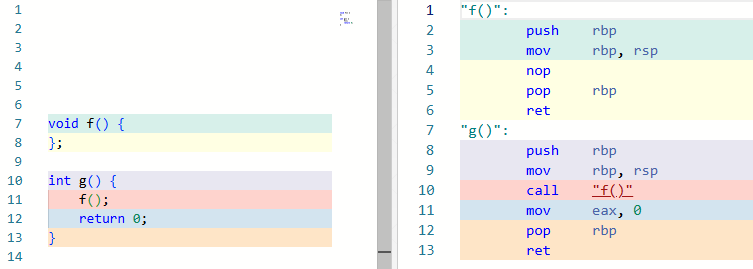
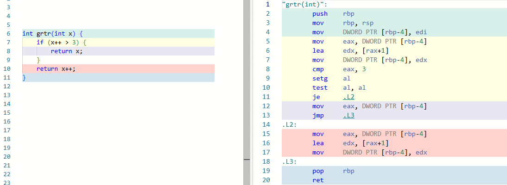

Ассемблер транслирует текст, написанный на языке ассемблера, в машинный код. Наиболее популярными ассемблерами являются MASM (Macro Assembler, ml.exe) в экосистеме Windows и open-source ассемблеры FASM (Flat Assembler) и NASM (Netwide Assembler).

Язык ассемблера, в отличие от языков высокого уровня, представляет собой **однозначное** представление набора машинных команд. По этой причине языки для разных аппаратных платформ отличаются.

Существует два вида синтаксиса:

При этом в синтаксисах различаются мнемонические наименования (мнемоники) опкодов. Для переключения синтаксиса:
```
objdump -M intel
echo "set dis intel" > ~/.gdbinit
```

х86 поддерживает сложный формат адресации памяти для инструкций. Каждая ссылка может включать базовый регистр, индексный регистр, множитель для индекса от 1 до 8 и 32-битное смещение:
```asm
MOV EAX, [ESI + EDI * 8 + 0x50] ; сложная адресная ссылка помещается в скобки
```

x386 – это базовый набор команд Intel x86/x64, однако существуют расширения, увеличивающие производительность при работе с графикой, звуком, криптографией. Например, расширение MMX (MultiMedia Extension) 1997 позволило работать с целочисленными векторными вычислениями напрямую на процессоре, а AES-NI 2008 ускорило шифрование по алгоритму AES с защитой от side-channel атак.

Данные типизируются по размеру:
- `BYTE` - 8 бит
- `WORD` - 2 байт
- `DWORD` - 4 байта
- `QWORD` - 8 байт

> В gdb word представляет собой четырехбайтовое значение, двухбайтовое называется halfword, а восьмибайтовое - giant

Для работы с целыми числами старший разряд выделяется под знак, где `0` означает положительное число, а `1` - отрицательное. При этом результат операции над целыми числами сохраняется в регистре SF (Sign Flag).

Числа с плавающей точкой обрабатываются в математическом сопроцессоре FPU (регистры `st0`–`st7`) и расширение SSE (регистры `xmm0`–`xmm15`).

Создание конструкций условных переходов, циклов, вызов подпрограмм осуществляется при помощи **инструкций передачи управления**. 

К безусловным переходам относят инструкции `JMP`, `CALL` и `RET`. `JMP` переходит на выполнение инструкций по указанному адресу, как правило так реализуются операторы `goto`, `break` и `continue`.

`CALL` используется для вызова функции и `RET` для возвращения из нее:

На скриншоте видно пролог функции: адрес вызывающей функции `RBP` сохраняется на стек командой `push`, после чего в регистр `RBP` устанавливается адрес текущей функции `RSP`. В эпилоге функции `pop rbp` возвращает `RBP` в исходное состояние. Возвращаемое значение передается из функции в регистре `EAX`.

Условные переходы реализуются командами условных переходов `jxxx` с командами сравнения `test`/`cmp`:



нативные вставки в с с++