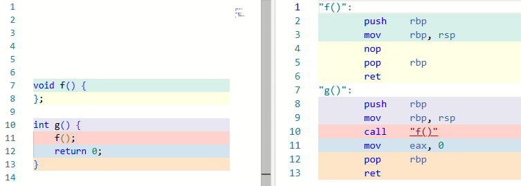
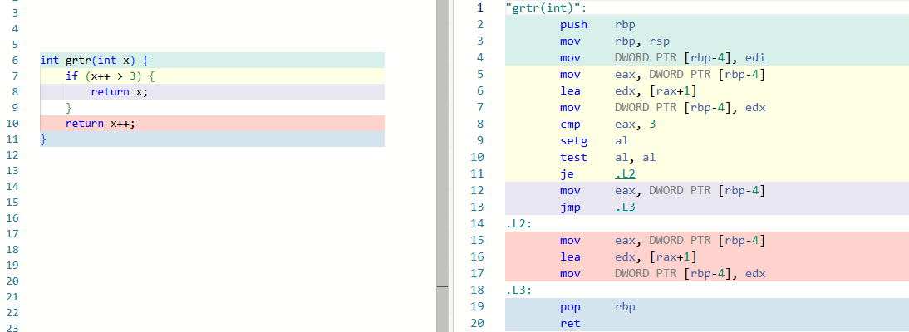

Ассемблер транслирует текст, написанный на языке ассемблера, в машинный код. Наиболее популярными ассемблерами являются MASM (Macro Assembler, ml.exe) в экосистеме Windows и open-source ассемблеры FASM (Flat Assembler) и NASM (Netwide Assembler).

Язык ассемблера, в отличие от языков высокого уровня, представляет собой **однозначное** представление набора машинных команд. По этой причине языки для разных аппаратных платформ отличаются.

Существует два вида синтаксиса:

При этом в синтаксисах различаются мнемонические наименования (мнемоники) опкодов. Для переключения синтаксиса:
```
objdump -M intel
echo "set disassembly-flavor intel" > ~/.gdbinit
```

х86 поддерживает сложный формат адресации памяти для инструкций. Каждая ссылка может включать базовый регистр, индексный регистр, множитель для индекса от 1 до 8 и 32-битное смещение:
```asm
MOV EAX, [ESI + EDI * 8 + 0x50] ; сложная адресная ссылка помещается в скобки
```

x386 – это базовый набор команд Intel x86/x64, однако существуют расширения, увеличивающие производительность при работе с графикой, звуком, криптографией. Например, расширение MMX (MultiMedia Extension) 1997 позволило работать с целочисленными векторными вычислениями напрямую на процессоре, а AES-NI 2008 ускорило шифрование по алгоритму AES с защитой от side-channel атак.

Данные типизируются по размеру:
- `BYTE` - 8 бит
- `WORD` - 2 байт
- `DWORD` - 4 байта
- `QWORD` - 8 байт

> В gdb word представляет собой четырехбайтовое значение, двухбайтовое называется halfword, а восьмибайтовое - giant

Для работы с целыми числами используется метод two's complement: отрицательное число записывается как побитовая инверсия положительного + 1. В отличие от метода one's complement, где отрицательное число записывается просто как инверсия, этот метод не приводит к появлению двух нулей - `0000 0000` и `1111 1111` (как бы -0). При этом процессор не знает, знаковое это число или нет, и работает с ним в зависимости от инструкции:  `IDIV` знаковое деление, `DIV` беззнаковое; `JG`/`JL` переход для знаковых, `JA`/`JB`  для беззнаковых. При этом в результате операции старший бит сохраняется в регистр SF (Sign Flag), если число интерпретируется как знаковое, то `SF=1` интерпретируется как отрицательное значение, а если как беззнаковое, то игнорируется.

Числа с плавающей точкой обрабатываются в математическом сопроцессоре FPU (регистры `st0`–`st7`) и расширение SSE (регистры `xmm0`–`xmm15`). Формат числа при этом IEEE 754:
```
┌──────┬─────────────┬─────────────────────────┐
│ sign │  exponent   │       mantissa          │
│ 1 бит│  N бит      │       M бит             │
└──────┴─────────────┴─────────────────────────┘
```
, где `value = (-1)^sign × 1.mantissa × 2^(exponent - bias)`
Длина экспоненты, мантиссы и смещения определяется форматом:

|Формат|Общий размер|Sign|Exponent|Mantissa|Смещение (bias)|
|---|---|---|---|---|---|
|**binary16** (half)|16 бит|1|5|10|15|
|**binary32** (float)|32 бита|1|8|23|127|
|**binary64** (double)|64 бита|1|11|52|1023|
|**binary128** (quad)|128 бит|1|15|112|16383|

Создание конструкций условных переходов, циклов, вызов подпрограмм осуществляется при помощи **инструкций передачи управления**. 

К безусловным переходам относят инструкции `JMP`, `CALL` и `RET`. `JMP` переходит на выполнение инструкций по указанному адресу, как правило так реализуются операторы `goto`, `break` и `continue`.

`CALL` используется для вызова функции и `RET` для возвращения из нее:

На скриншоте видно пролог функции: адрес вызывающей функции `RBP` сохраняется на стек командой `push`, после чего в регистр `RBP` устанавливается адрес текущей функции `RSP`. В эпилоге функции `pop rbp` возвращает `RBP` в исходное состояние. Возвращаемое значение передается из функции в регистре `EAX`.

Условные переходы реализуются командами условных переходов `jxxx` с командами сравнения `test`/`cmp`:


В отличии от инструкции `MOV`, обращающейся к памяти, чтобы получить значение из нее, `LEA` (load effective address) только вычисляет адрес и записывает в регистр значение этого адреса. Поскольку вычисления с `LEA` имеют аппаратное ускорение, компиляторы иногда используют эту инструкцию для быстрых вычислений, не имеющих отношения к работе с памятью:
```asm
lea eax, [edi  + 1] ; inc значения edi без изменения EFLAGS и обращения к RAM
```


нативные вставки в с с++