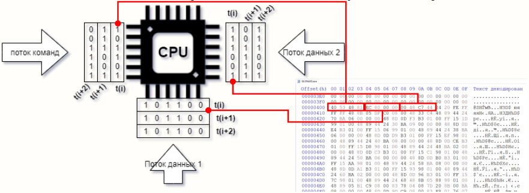
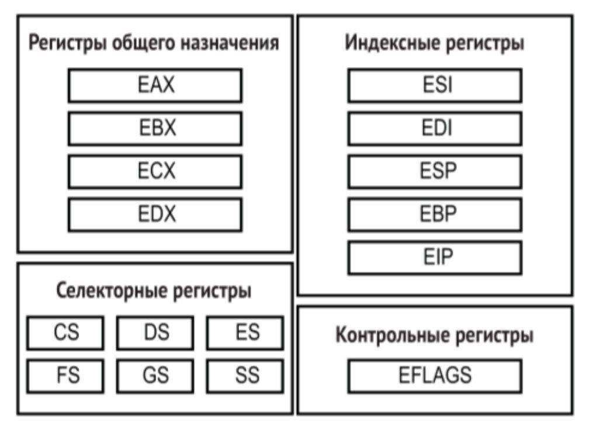
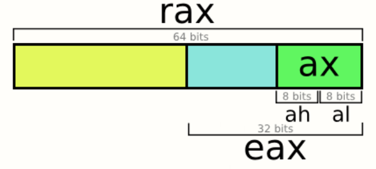

Машинный код - это система команд (инструкций), которая передаются на CPU как уровни напряжений и интерпретируются им. Команда состоит из опкода (кода операции) и операндов (данных или адресов, с которыми надо работать).



Инструкции записываются в little endian - наименьший разряд (little end) находится по наименьшему адресу. Когда мы записываем число `0x00fc45c7`, мы читаем байты в обратном порядке: `00 FC 45 C7`.
# Архитектуры

Набор регистров и инструкций процессора определяет ISA (Instruction Set Architecture).

Каждая инструкция процессора представляется в виде числа. В архитектурах RISC (Reduced Instruction Set Computer) это число фиксированной длины, в архитектурах CISC (Complex Instruction Set Computer) - переменной. К примеру, инструкция `NOP` занимает 1 байт (`0x90`), `ADD EAX, EBX` - 2 байта (`0x01 0xD8`), а `MOV DWORD PTR [EBP-4], 0` - 7 байт (`0xC7 0x45 0xFC 0x00 0x00 0x00 0x00`).

Инструкции фиксированной длины позволяют снизить энергопотребление за счет упрощения декодера инструкций. С другой стороны, увеличение разнообразия инструкций процессора CISC архитектурами позволяет минимизировать использование памяти. Она была создана во времена, когда программы писались на ассемблере, поэтому машинный код CISC представляется более человекочитаемо, чем код RISC, оптимизированный под использование компиляторами.

В CISC большинство арифметических и логических инструкций могут напрямую работать с памятью (например, `ADD [EAX], EBX`). В RISC-архитектурах (Load/Store) операции проводятся только над регистрами, а память доступна исключительно через явные команды `LOAD` и `STORE`. Доступ к памяти - самая медленная операция (в сотни раз медленнее сложения в регистрах). Заставляя компилятор явно разделять обращение к памяти и вычисления, процессор может выполнять следующие арифметические инструкции, которые не зависят от этой загрузки, пока ждет загрузки данных. Однако в результате количество регистров намного превышает набор CISC.

| Архитектура                                                | Тип  | Где используется                                                                                                                         |
| ---------------------------------------------------------- | ---- | ---------------------------------------------------------------------------------------------------------------------------------------- |
| x86-64 / AMD64                                             | CISC | Настольные ПК, ноутбуки (чипы AMD Ryzen и Intel Core), серверы (AMD EPYC, Intel Xeon), мощные игровые консоли (PS5, Xbox Series X)       |
| ARM (Advanced RISC Machine)                                | RISC | Практически все смартфоны и планшеты, энергоэффективные ноутбуки (Apple Silicon M-серия, Snapdragon X Elite), устройства IoT             |
| MIPS (Microprocessor without Interlocked Pipelined Stages) | RISC | Исторически игровые приставки (Nintendo 64, PS1, PS2, PSP). Сейчас встречаются в сетевом оборудовании (маршрутизаторы, домашние роутеры) |
| RISC-V                                                     | RISC | Ускорители искусственного интеллекта, микроконтроллеры, управляющие чипы в SSD и видеокартах, космическая отрасль                        |
https://freedium-mirror.cfd/https://medium.com/swlh/what-does-risc-and-cisc-mean-in-2020-7b4d42c9a9de

## Регистры и стек

Регистры - это память процессора для быстрого доступа фиксированного размера.  В CISC часть регистров используются процессором напрямую, другие - для управления стеком оперативной памяти, так называемые индексные регистры. 



Данные на стек добавляются командой `PUSH` и получаются командой `POP` по принципу LIFO. Указатель на вершину стека хранится в х86 хранится в регистре `ESP`, в х64 в регистре `RSP`, и неявно изменяется этими командами. Доступ к этому регистру может быть получен как и к регистру общего назначения.

Адрес начала стека сохраняется в `EBP`/`RBP`. `RSI` и `RDI` используются как адрес источника и адрес назначения в операциях копирования и сравнения данных, а также для передачи первых двух аргументов в прологе функции в х64. 

`EIP`/`RIP` хранит указатель на код, который будет запущен после команды безусловного `JMP` или условного перехода `JE`/`JL`/..., а также команды вызова `CALL`. К этому регистру нельзя обращаться как к регистру общего назначения, его могут изменять только инструкции управления - `CALL`, `JMP` и `RET`. В 64-битной архитектуре также вводится относительная адресация  со смещением от `RIP`. 

В регистрах общего назначения сохраняются результаты математических операций, EFLAGS используются для переключения состояний в процессе -  `CF`  устанавливается, если при сложении возник перенос из старшего бита или при вычитании потребовался заем; `SF` (Sign повторяет старший бит результата (0 для положительных, 1 для отрицательных чисел); `OF` устанавливается при переполнении знакового диапазона и т.д.



Инструкции могут обращаться к части регистра, используя соглашения о наименованиях, как показано на рисунке
## x86 vs x64

Архитектура x86-64 была разработана компанией AMD в 1999 году как 64-битное расширение классического 32-битного набора инструкций Intel x86. Intel в то время продвигала неудавшуюся 64-битную архитектуру IA-64 (Itanium), поэтому разработка AMD стала индустриальным стандартом для ПК и серверов.

У x86 (в 32-битном режиме) всего 8 общих регистров (EAX, EBX, ECX, EDX, ESI, EDI, EBP, ESP). 
В 64-битном x86 16 общих регистров, в ARM64 31. Меньшее количество регистров в x86 означает, что компиляторам приходится чаще обращаться к стеку, что делает код более "многословным", но более понятным при работе с памятью.

В x86 аргументы функции обычно передаются через стек. В декомпиляторе или отладчике легко увидеть пролог функции `PUSH arg3`, `PUSH arg2`, `PUSH arg1`, `CALL func`. Границы функций и тип передаваемых данных читаются со стека очевидно и линейно.

В x64 используется соглашение о вызовах "\_\_fastcall". Первые несколько аргументов передаются через регистры (`rcx`, `rdx` в Windows, `rdi`, `rsi` в Linux и Mac). Регистры постоянно переиспользуются в теле функции для временных вычислений. 

В x64 была введена адресация относительно указателя инструкции `RIP`. Это означает, что доступ к глобальным переменным, константам и строкам осуществляется как `[rip + смещение]`. В x86 для этого используются абсолютные адреса - `MOV EAX, [0x00403000]`.

В x64 на Windows компилятор обязан выделять на стеке 32 байта (Shadow Space) перед каждым вызовом функции, даже если аргументы переданы через регистры.

# Бинарные файлы

Большинство форматов бинарных файлов основаны на COFF (Common Object File Format), к ним относятся ELF (Executable and Linkable Format), PE (Portable Executable) и PE+ (64 битный). Apple использует формат Mach-O.

Среди них можно выделить:
- самостоятельные приложения (\*.exe/\*.com/\*.elf)
- объектные файлы (\*.obj/\*.o)
- статические (\*.lib/\*.a) и динамические (\*.dll/\*.so) библиотеки, которые могут использоваться как приложениями, так и другими библиотеками
- драйверы (\*.sys)

## Компиляция

Исполняемые файлы могут собираться из объектных в процессе раздельной компиляции. Раздельная компиляция позволяет ускорить процесс пересборки за счет создания промежуточного представления отдельных файлов исходного кода в виде объектных файлов. Набор объектных файлов может быть собран в статическую библиотеку.

Во время компиляции линковщик (компоновщик) собирает объектные файлы из файлов исходников, разрешает внешние ссылки (например, функция `printf`) и правит их адреса, включая в файл таблицу импорта и точку входа. 

В контексте реверса объектные файлы интересны тем, что в них сохраняются имена символов и релокации, что позволяет анализировать функции по именам вместо адресов в памяти. Как правило, их получают из статических библиотек.

В результате компиляции также создаются побочные файлы - отладочные (\*.pdb/\*.dwarf/\*.map) и промежуточные (\*.ilk/\*.exp), за счет которых оптимизируется процесс сборки и отладки приложения. Промежуточные файлы представляют основной интерес для инструментов сборки, в то время как отладочные упрощают реверс приложения.

В то время, как \*.pdb представляет собой отдельный файл, путь к которому прописывается внутрь \*.exe файла, собранного в режиме отладки, dwarf встраивается прямо внутрь \*.elf в секции `.debug_*`.

## JIT-компиляция и интерпретация

Программный код может читаться построчно и сразу выполняться интерпретатором, как, например, делает Bash. 

Однако, существует и гибридный подход, в котором создается виртуальная машина со своим набором инструкций (байткодом), моделью памяти и правилами исполнения, в которой интерпретатор выполняет функцию процессора. Байт-код может исполняться этой машиной напрямую (CPython) или использоваться для трансляции в машинный код. Так, JVM использует специальный профилировщик, собирающий статистику по наиболее часто использующимся частям кода, которые затем JIT-компилируются для оптимизации скорости.

Android использует свою собственную виртуальную машину Android Runtime (ART), до Android 4.4 называвшуюся Dalvik. Байткод Dalvik сохраняется в формате DEX и распространяется внутри \*.apk файлов и частично компилируется в машинный код перед первым запуском приложения на основе установленных на устройстве профилей, частично JIT-компилируются, частично интерпретируется. 

# Загрузка в память

Загрузчик ОС читает таблицу заголовков бинарного файла, откуда получает адрес точки входа, список сегментов и таблицу импорта. Заголовок файла всегда располагается в начале и содержит смещение до таблицы заголовков, которая может располагаться произвольно.

Далее система выделяет для процесса виртуальную память. Процесс изолируется от других процессов за счет того, что работает с виртуальными адресами, которые ОС переводит в физические при помощи MMU (Memory Management Unit) и таблицы страниц. Для каждого нового процесса ядро создает новую таблицу. Когда программа обращается к виртуальному адресу, MMU возвращает запись в таблице, но если страница не загружена, возникает прерывание (page fault), в результате которого она загружается в память с диска.

В Windows процесс создается в один этап через системную функцию `CreateProcess`. В Linux процесс создается в два этапа: сначала дублируется адресное пространство родителя через системный вызов `fork`, что позволяет 1) выстраивать процессы иерахически за счет того, что любой процесс имеет родителя 2) применять оптимизацию Copy-on-Write. На следующем этапе вызова `exec` ядро полностью заменяет образ процесса новым пустым адресным пространством.

Далее секции исполняемого файла отображаются в память, при этом фактическая загрузка осуществляется только в результате прерывания для оптимизации. В современных ОС используется механизм рандомизации адресов секций - ASLR, меняющий расположение секций при каждом запуске в целях безопасности.

Ядро создает стек процесса на верхних адресах (самое большое доступное число) выделенной памяти, и растет вниз - при `push` указатель стека `RSP` уменьшается. Исторически стек растет в направлении находящейся внизу кучи.

```
0xFFFFFFFFFFFFFFFF  
0x00007FFFFFFFFFFF  ┌─────────────────────┐
                    │  Стек               │ 
                    │  ↓ растёт вниз      │
                    ├─────────────────────┤
                    │  ...                │
                    ├─────────────────────┤
                    │  Куча (heap)        │
                    │  ↑ растёт вверх     │
                    ├─────────────────────┤
                    │  .bss(глобальные    |          
                    │       переменные)   |
                    ├─────────────────────┤
                    │  .data              │
                    ├─────────────────────┤
                    │  .text(секция кода) │
0x0000000000400000  └─────────────────────┘
0x0000000000000000
```

Управление передается интерпретатору (`ld-linux.so`/`ntdll.dll`) , который загружает недостающие динамические библиотеки и передает управление функции рантайма (`_start` / `mainCRTStartup`), инициализирующую Thread-Local Storage и стандартную библиотеку. Рантайм использует часть свободного пространства для создания кучи через `brk`/`mmap` (Linux) или `VirtualAlloc`/`HeapAlloc` (Windows).

Только после этого управление переходит в main исполняемого файла.