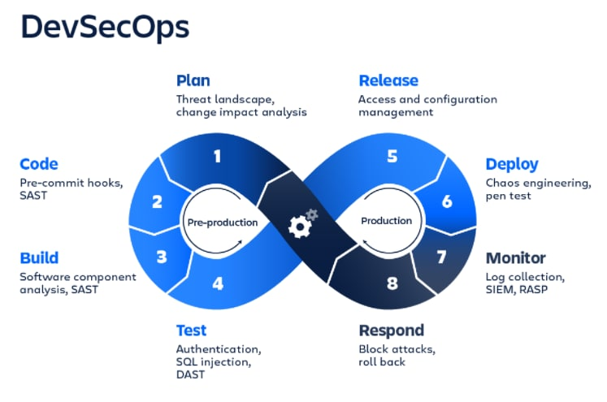
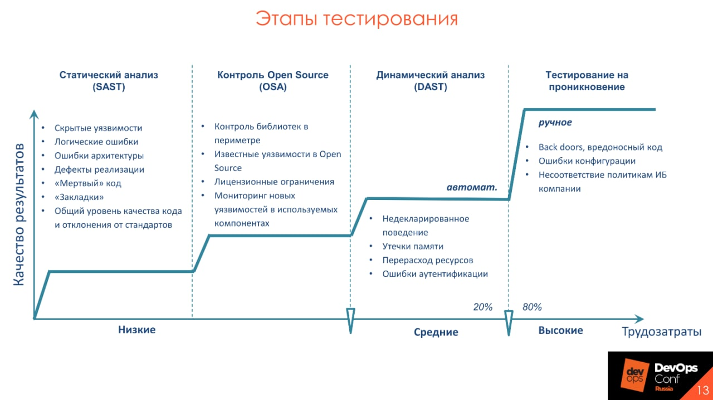

Security artifacts:
- Policies (guidelines, requirements, developments practices)
- Controls (access control, FW, monitoring, etc)
- Tests (SAST, DAST, IAST\[hybrid\], SCA\[software composition analysis\])
- Incident response plan and recovery
- Compliance
- Architecture diagrams

## Tests

#### Trivy

Использует метаданные пакетных менеджеров и SAST докерфайла для анализа зависимостей. Эту особенность можно использовать для сокрытия пакетов: https://habr.com/ru/companies/swordfish_security/articles/822705/. 

Может использоваться для формирования SBOM (Software Bill of Material).

SBOM – это файл в формате JSON или XML, который включает в себя инвентаризационный список всех компонентов (пакетов, библиотек), используемых в разрабатываемом приложении или необходимых для его работы. Существуют различные форматы - CycloneDX, SPDX (Software Packet Data Exchange) и SWID (Software Identification) и другие.

## Cloud

В безопасную работу в облаке вносят вклад и облачный провайдер, и пользователь. Это называется разделяемой ответственностью (shared responsibility).

