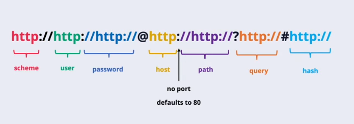
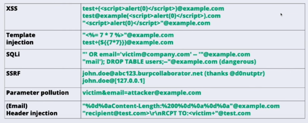

## Domain name

Domain RFC specifies that *every* part of a domain name should have a trailing dot. For example, the correct way to write is `www.google.com.`. But in context of web applications it can lead to different bugs, because origin `www.google.com` is completely different from `www.google.com.`.

For example, suppose a web application that takes user input and register the specified domain name if it doesn't exist yet. If we can add the trailing dot, the validation logic will be bypassed which leads to a subdomain takeover.

## URLs

```
http://http://http://@http://http://?http://#http://
http://1://http://@2://http://?3#http://4
http://http://1@http://2?http://#3
```




### Path discrepancies

^199b77

Path discrepancies occur when two or more systems malign on how a file route is interpreted.

- changing text capitalization `/admin` -> `/ADMIN` and `/aDmiN`
- adding an extension, usually works in Spring with `useSuffixPatternMatch` (default prior to 5.3) `/admin` -> `/admin.jpeg`

## Email

According to the RFC 2822, an email address can actually have:

- Printable characters (except dots!): `!#$%&'*+/-=?^_{|}~`
- UTF characters and emojis: `日本( ☻ ω ☻ )🙏🏿c̬̟h͡a̫̻̯͘o̫̟̖͍̙̝͉s̗̦̲жопаⓖⓞⓞⓖⓛⓔ.com`

in the local part (e.g. `alice.doe` in `alice.doe@example.com`). If the local part is quoted (`"alice.doe"`) it can also include:

- `()[]\@,:;<>`
- White characters, such as tabs and spaces (even %0d%0a)

The local part support such mechanism as tagging and comments. 

Tagging can be done via `+-{}` characters. Sometimes you can create different account on the same email using this feature. But in case the web application avoids this part, you can try to use the same trick that was discussed in the first paragraph about the domain name trailing dot.

Comments can be placed in the beginning and the end of the local part. So these are *valid* examples of weirdo emails:

- `name(payload)@example.com`
- `name"payload"@example.com`
- `name{7*7}@example.com`

The domain name part of the email address can include unicode symbols and specify the IP address in several ways:

- `name@ⓖⓞⓞⓖⓛⓔ.com
- `name@[IPV6:2001:db8::1]`
- `name@[127.0.0.1]`

Putting it all together, ladies and gentlemen, valid emails:


You can also use this feature to bypass domain whitelisting:
- `inti(;inti@inti.io;)@whitelisted.com`
- `inti@int.io(@whitelisted.com)`
- `inti+(@whitelisted.com;)@inti.io`
## Phone

Besides the global `+7` and local `(880)5553535` phone numbers can actually have the optional parameter part:
- `;phone-context=<script>alert(1)</script>` - `phone-context` is used by old phones to get a domain name of caller, so that actually can do some kind of DNS quering
- `;ext=+32`
- `;isub=12345`
- `*102#`
While the first one allows you to try different reflection methods, the last ones can be used to bypass rate limiting on forgot password functionality.

## Unicode

Most applications utilize UTF-8, which uses variable lengths (1 to 4 bytes) to represent text. 

### Unicode Overflow

When an application tries to store a Unicode character in a single byte, it uses modulus 256 to leave out rest of the character (for example `0x4E41` will result in `0x41`). An attacker simply needs to provide a character who's codepoint is greater than 255 to generate blocked characters and bypass a restriction.

### Unicode Truncation

If a unicode text is passed, an application can try to truncate it, for example, to fit text into a SQL `VARCHAR(10)` byte-limited database column. There are multiple approaches, each of which has its own pitfalls.

1. Byte-Based Truncation. Multi-byte UTF-8 characters (which take 2 to 4 bytes) get chopped in half. This leaves trailing orphan bytes and may result in filter bypass.
![[nodejs-unicode.png]]
   
2. Code Unit Truncation. UTF-8 and UTF-16 define code unit as a chunk of a fixed length (8 and 16 bits respectively). This approach ignores surrogate pairs and may leave out lone surrogates. Some mechanisms (such as `ce.escapeSelector` in DOM libraries) may miscalculate string lengths or fail to hex-encode the second half of a surrogate pair and result into a dangerous payload being passed.

> A Unicode surrogate is a special 16-bit code value used exclusively in the UTF-16 encoding to represent characters that fall outside the Basic Multilingual Plane (BMP), such as emojis. They are divided into 1,024 **High Surrogates** (U+D800–U+DBFF) and 1,024 **Low Surrogates** (U+DC00–U+DFFF), which are usually used together, creating **surrogate pairs**. **Lone surrogates** are surrogates without its paired counterpart, forming an invalid Unicode sequence.

An API blacklists the exact string `"role=admin"`, which an attacker bypasses with`"admin\uD888"` . The application then stores the string in a MySQL database using the older `utf8` (3‑byte) character set. Because `\uD888` is a 4‑byte UTF‑8 sequence, MySQL truncates the string at that point (or discards the invalid sequence), leaving `"role=admin"` in the database – effectively granting admin privileges.

#### Sources
- http://cweb.github.io/unicode-security-guide/
- https://seriot.ch/resources/talks_papers/i_love_unicode_softshake.pdf
- https://seriot.ch/resources/talks_papers/20141106_asfws_unicode_hacks.pdf
- https://lab.ctbb.show/research/unicode-surrogates-to-replacement-characters
- https://portswigger.net/research/bypassing-character-blocklists-with-unicode-overflows
- https://portswigger.net/research/splitting-the-email-atom#unicode-overflows
- https://appcheck-ng.com/unicode-normalization-vulnerabilities-the-special-k-polyglot/

### IDNA standard
...

## JSON
by [cybred](https://t.me/cybred)

Возьмем небольшое приложение с двумя микросервисами:
- Cart - реализует бизнес-логику корзины
- Payment - используется для обработки платежей

Cart написан на Python с Flask и принимает ID товаров с их количеством. Попробуем отправить в него запрос с двумя одинаковыми ключами:
```
"cart": [
    {
        "id": 0,
        "qty": 5
    },
    {
        "id": 1,
        "qty": -1,
        "qty": 1
    }
]
```
Сервис провалидирует JSON в соответствии со схемой `jsonschema.validate(instance=data, schema=schema`). Убедится, что `id: 0 <= x <= 10 and qty: >= 1`. На этом этапе не будет ошибки (не смотря на то, что один из отправленных `qty` не подходит под условие), поскольку Flask использует [стандартный JSON-парсер](https://www.json.org/json-en.html) из Python, а тот сериализует данные, отдавая приоритет последнего ключа (qty = 1).

Дальше провалидированный JSON отправляется в микросервис Payment.

А микросервис Payment написан уже на Go и использует другой парсер [buger/jsonparser](https://github.com/buger/jsonparser). Он уже не валидирует JSON (ведь валидация была на предыдущем шаге), но использует приоритет первого ключа (`qty = -1`). Считает итоговую сумму `total = total + productDB[id]["price"].(int64) * qty` и генерирует чек.

Мы смотрим в чек, который вернулся в ответе, и видим ошибку. Нам будет отправлено шесть товаров стоимостью 700 долларов, но с нас взяли только 300 долларов, из-за расчетов со вторым ключом.

Такие ошибки возникают из-за того, что существует много стандартов JSON:
1. [json.org](http://www.json.org/)
2. [IETF RFC 4627](https://tools.ietf.org/html/rfc4627)
3. [ECMAScript 262](http://www.ecma-international.org/ecma-262/5.1/#sec-15.12)
4. [ECMA 404](http://www.ecma-international.org/publications/standards/Ecma-404.htm)
5. [IETF RFC 7158](https://tools.ietf.org/html/rfc7158)
6. [IETF RFC 7159](https://tools.ietf.org/html/rfc7159)
7. [JSON5](https://json5.org/)
8. [HJSON](https://hjson.github.io/)

И в каждом из них свои правила парсинга JSON: о том, как обрабатывать дублирующие ключи, что делать с большими числами с плавающей точкой, что считать валидным, а что нет. И на каждом из этих этапов могут возникнуть коллизии, позволяющие обходить средства защиты или вызывающие баги в бизнес логике.

Полезные ссылки:
- https://seriot.ch/json/parsing.html — большая таблица-сравнение: как разные парсеры обрабатывают разные значения.
- https://bishopfox.com/blog/json-interoperability-vulnerabilities — я рассказал только об одном баге, но их гораздо больше: здесь можно почитать обо всех остальных.
- https://github.com/a1phaboy/JsonDetect — расширение для Burp для определения того, какой парсер используется.
## XML
[[XXE]]