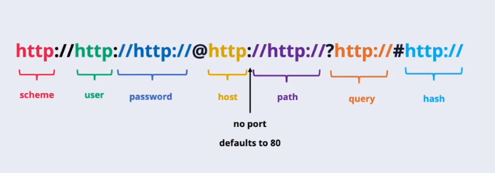

orangetsai, securinti compilation
## Domain name

Domain RFC specifies that *every* part of a domain name should have a trailing dot. For example, the correct way to write is `www.google.com.`. But in context of web applications it can lead to different bugs, because origin `www.google.com` is completely different from `www.google.com.`.

For example, suppose a web application that takes user input and register the specified domain name if it doesn't exist yet. If we can add the trailing dot, the validation logic will be bypassed which leads to a subdomain takeover.

## URLs

```
http://http://http://@http://http://?http://#http://
http://1://http://@2://http://?3#http://4
http://http://1@http://2?http://#3
```



## Email

According to the RFC 2822, an email address can actually have:

- Printable characters (except dots!): `!#$%&'*+/-=?^_{|}~`
- UTF characters and emojis: `日本( ☻ ω ☻ )🙏🏿c̬̟h͡a̫̻̯͘o̫̟̖͍̙̝͉s̗̦̲жопаⓖⓞⓞⓖⓛⓔ.com`

in the local part (e.g. `alice.doe` in `alice.doe@example.com`). If the local part is quoted (`"alice.doe"`) it can also include:

- `()[]\@,:;<>`
- White characters, such as tabs and spaces (even %0d%0a)

The local part support such mechanism as tagging and comments. 

Tagging can be done via `+-{}` characters. Sometimes you can create different account on the same email using this feature. But in case the web application avoids this part, you can try to use the same trick that was discussed in the first paragraph about the domain name trailing dot.

Comments can be placed in the beginning and the end of the local part. So these are *valid* examples of weirdo emails:

- `name(payload)@example.com`
- `name"payload"@example.com`
- `name{7*7}@example.com`

The domain name part of the email address can include unicode symbols and specify the IP address in several ways:

- `name@ⓖⓞⓞⓖⓛⓔ.com
- `name@[IPV6:2001:db8::1]`
- `name@[127.0.0.1]`

Putting it all together, ladies and gentlemen, valid emails:


You can also use this feature to bypass domain whitelisting:
- `inti(;inti@inti.io;)@whitelisted.com`
- `inti@int.io(@whitelisted.com)`
- `inti+(@whitelisted.com;)@inti.io`
## Phone

Besides the global `+7` and local `(880)5553535` phone numbers can actually have the optional parameter part:
- `;phone-context=<script>alert(1)</script>` - `phone-context` is used by old phones to get a domain name of caller, so that actually can do some kind of DNS quering
- `;ext=+32`
- `;isub=12345`
- `*102#`
While the first one allows you to try different reflection methods, the last ones can be used to bypass rate limiting on forgot password functionality.

## Unicode

http://cweb.github.io/unicode-security-guide/


### IDNA standard
...

## JSON
[[JSON abuse]]

## XML
[[XXE]]